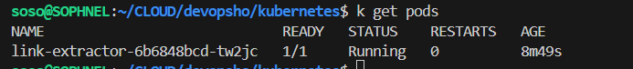
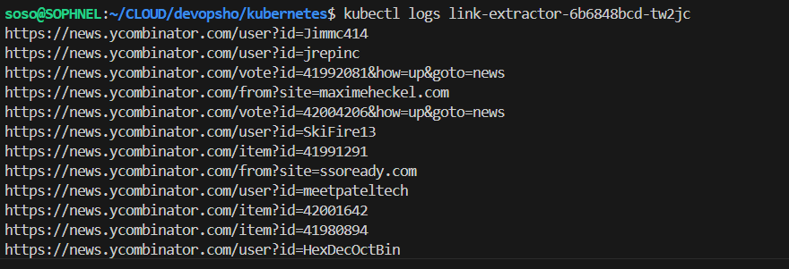

# Kubernetes Deployment for Link Extractor

This document provides an explanation of the Kubernetes deployment configuration for the `link-extractor (url_extractor)` application.

## Deployment Configuration

The deployment configuration is defined in the `deployment.yml` file. Below is a breakdown of each section of the configuration:

### Kind and Metadata

```yaml
kind: Deployment
metadata:
    name: link-extractor
```

- **kind**: Specifies the type of Kubernetes object. In this case, it is a `Deployment`.
- **metadata**: Contains metadata about the deployment, including the name `link-extractor`.

### Spec

```yaml
spec:
    replicas: 1
    selector:
        matchLabels:
            app: link-extractor
```

- **spec**: Defines the desired state of the deployment.
- **replicas**: Specifies the number of pod replicas to run. Here, it is set to 1.
- **selector**: Defines how the deployment finds which pods to manage using labels. It matches pods with the label `app: link-extractor`.

### Template

```yaml
template:
    metadata:
        labels:
            app: link-extractor
    spec:
        containers:
        - name: link-extractor
            image: bobocuillere/devopsho:latest
            imagePullPolicy: Never
            args: ["-u", "https://news.ycombinator.com/", "-o", "stdout"]
            resources:
                limits:
                    memory: "512Mi"
                    cpu: "500m"
            securityContext:
                runAsUser: 1000
                runAsNonRoot: true
```

- **template**: Describes the pods that will be created by the deployment.
    - **metadata**: Contains labels for the pods. Here, it labels the pods with `app: link-extractor`.
    - **spec**: Defines the specification for the pod's containers.
        - **containers**: Lists the containers that will run in the pod.
            - **name**: The name of the container.
            - **image**: The Docker image to use for the container. Here, it uses `bobocuillere/devopsho:latest`.
            - **args**: Arguments passed to the container. Here, it includes the URL to extract links from and the output method.
            - **resources**: Specifies the resource limits for the container.
                - **limits**: Defines the maximum amount of resources the container can use.
                    - **memory**: Limits the memory usage to `512Mi`.
                    - **cpu**: Limits the CPU usage to `500m`.
            - **securityContext**: Defines security settings for the container.
                - **runAsUser**: Specifies the user ID to run the container as. Here, it is set to `1000`.
                - **runAsNonRoot**: Ensures the container runs as a non-root user.


## Deploying to Minikube

1. **Start Minikube**

    ```bash
    minikube start
    ```

2. **Build Docker Image in Minikube's Docker Environment**

    Configure Docker to use Minikube's Docker daemon:

    ```bash
    eval $(minikube docker-env)
    ```

    Build the Docker image:

    ```bash
    docker build -t url-extractor:latest .
    ```

3. **Deploy the Application**

    ```bash
    kubectl apply -f kubernetes/deployment.yml
    ```

4. **Verify Deployment**
     
    Check the status of the pods:

    ```bash
    kubectl get pods
    ```
    
    View logs of the pod:
    
    ```bash
    kubectl logs <pod-name>
    ```

5. **Revert Docker Environment (Optional)**

    ```bash
    eval $(minikube docker-env -u)
    ```

## Conclusion

This deployment configuration ensures that the `link-extractor` application runs securely and efficiently within a Kubernetes cluster. By setting resource limits and security contexts, it helps maintain stability and security in the deployment environment.