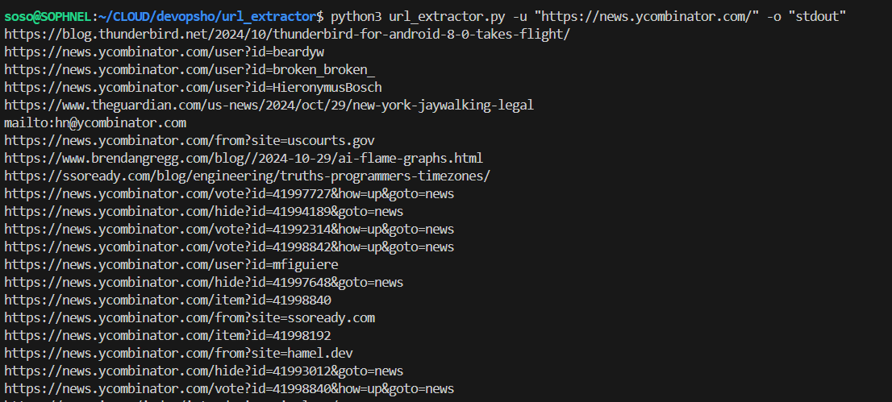

# Python Program to Extract Links

## Requirements Overview

### Command-Line Parameters:
- Accept any number of HTTP URLs using command-line arguments.
- Handle an output option `-o` which can be either "stdout" or "json".

### Functionality:
- Connect to each provided URL.
- Extract all links (`<a href="...">`) from the HTML content.
- Depending on the `-o` option, output the results in the specified format.

## Step-by-Step Implementation

### 1. Parsing Command-Line Arguments

I used the `argparse` module to handle command-line arguments. It sets up a parser that accepts URLs and an output option. The URLs are provided with the -u or --url flag, and the output format is specified with the -o or --output flag, which can be either "stdout" or "json".

```python
import argparse

def parse_arguments():
    parser = argparse.ArgumentParser(description='Extract links from provided URLs.')
    parser.add_argument('-u', '--url', action='append', required=True, help='URL to extract links from.')
    parser.add_argument('-o', '--output', choices=['stdout', 'json'], required=True, help='Output format.')
    return parser.parse_args()
```

### 2. Fetching the HTML Content

We can use the `requests` library to make HTTP requests.

```python
import requests

def fetch_html(url):
    try:
        response = requests.get(url)
        response.raise_for_status()
        return response.text
    except requests.exceptions.RequestException as e:
        print(f'Error fetching {url}: {e}')
        return ''
```

### 3. Extracting Links from HTML

We can use `BeautifulSoup` from the `bs4` library to parse HTML and extract links.
This function takes the HTML content and the base URL as inputs. It finds all `<a>` tags with `href` attributes, converts relative URLs to absolute URLs, and collects them in a set to avoid duplicates.

```python
from bs4 import BeautifulSoup
from urllib.parse import urljoin, urlparse

def extract_links(html_content, base_url):
    soup = BeautifulSoup(html_content, 'html.parser')
    links = set()
    for a_tag in soup.find_all('a', href=True):
        href = a_tag['href']
        # Convert relative URLs to absolute URLs
        absolute_url = urljoin(base_url, href)
        links.add(absolute_url)
    return links
```
### 4. Processing URLs and Collecting Results

This function processes each URL by fetching its HTML content and extracting links from it. It stores the results in a dictionary where the keys are the URLs and the values are sets of extracted links.

```python
def process_urls(urls):
    result = {}
    for url in urls:
        html_content = fetch_html(url)
        links = extract_links(html_content, url)
        result[url] = links
    return result
```

### 5. Handling Output Formats

We handle two output formats: "stdout" and "json". If the output format is "stdout", the function prints each link to the console. If the output format is "json", it organizes the links by domain and prints them as a JSON object.

```python
import json

def output_results(results, output_format):
    if output_format == 'stdout':
        for url, links in results.items():
            for link in links:
                print(link)
    elif output_format == 'json':
        json_output = {}
        for url, links in results.items():
            domain = '{uri.scheme}://{uri.netloc}'.format(uri=urlparse(url))
            paths = [urlparse(link).path or '/' for link in links]
            json_output[domain] = list(set(paths))
        print(json.dumps(json_output, indent=4))
```

### 6. Testing the Script

#### Example 1: Outputting Absolute URLs

```bash
python3 ./url_extractor.py -u "https://news.ycombinator.com/" -o "stdout"
```

#### Example 2: Outputting JSON Hash

```bash
python3 ./url_extractor.py -u "https://news.ycombinator.com/" -u "https://arstechnica.com/" -o "json"
```

## Dependencies

Ensure you have the required Python libraries installed:

```bash
pip3 install requests beautifulsoup4
```
